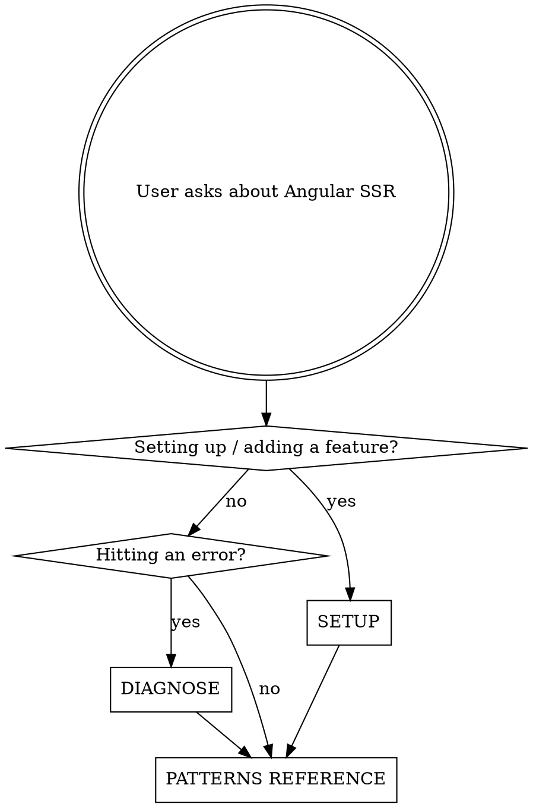

# Angular SSR

## Overview

**Core principle:** `ngSkipHydration` is a last resort, not a fix. Every SSR error has a root cause — find it first. Masking errors with skip directives creates silent mismatches and deferred crashes.

Targets Angular v17+ with built-in `@angular/ssr`. Does not cover Angular Universal or v16 and earlier.

## Entry Point



---

## SETUP

### Minimum correct config (v17+)

```typescript
// app.config.ts
provideClientHydration(withEventReplay())

// app.config.server.ts
provideServerRendering(withRoutes(serverRoutes))
```

`provideClientHydration()` must appear in **both** client and server bootstrap configs.

### HTTP Transfer State

Wrap `HttpClient` with `withHttpTransferCacheOptions()` — without it, every HTTP request fires twice (server + client). Never cache auth/sensitive headers; they can leak between requests.

### Incremental hydration

Use `withIncrementalHydration()` + `@defer (hydrate on ...)` blocks. Automatically enables event replay. Do not suggest eager full-app hydration when `@defer` applies.

### Engine selection

| Engine | When |
|---|---|
| `AngularNodeAppEngine` | v18+, Node.js (preferred) |
| `CommonEngine` | v17, Node.js (legacy) |
| `AngularAppEngine` | Non-Node platforms (Deno, Bun, edge) |

Check which engine the project already uses before suggesting changes.

### Server routes (`app.routes.server.ts`)

```typescript
export const serverRoutes: ServerRoute[] = [
  { path: 'about',   renderMode: RenderMode.Prerender },
  { path: 'profile', renderMode: RenderMode.Server },
  { path: '**',      renderMode: RenderMode.Client },
];
```

### i18n

Add `withI18nSupport()` if the app uses Angular i18n — i18n components skip hydration by default without it.

### Setup red flags

- `provideClientHydration()` missing from either config file
- `HttpClient` requests firing twice on page load
- `ngZone: 'noop'` — not supported with hydration
- `useValue` for server-side providers — must use `useFactory` (new instance per request)
- Auth headers included in HTTP Transfer State cache

---

## DIAGNOSE

### Process — run in order before suggesting any fix

1. Read the full error — it includes the component path
2. Navigate to that component
3. Look for: `document.*`, `window.*`, `localStorage`, `innerHTML`, `appendChild`, `setTimeout`/`setInterval` in constructor or `ngOnInit`
4. Check for invalid HTML: tables without `<tbody>`, `<div>` inside `<p>`, nested `<a>` elements
5. Check `preserveWhitespaces` — must be `false` in both `tsconfig.app.json` and `tsconfig.server.json`
6. Check if server and client render the same output — look for `@if` / `*ngIf` driven by browser-only state
7. Only after ruling all of the above: apply `ngSkipHydration` to that specific component

### NG05xx error codes

| Code | Meaning | Root Cause | Fix |
|---|---|---|---|
| NG0500 | Missing hydration annotations | `provideClientHydration()` missing or SSR not running | Add to both `app.config.ts` and `app.config.server.ts` |
| NG0501 | Skip hydration flag on mismatched node | Parent has `ngSkipHydration` but child expects hydration | Remove `ngSkipHydration` from parent or restructure |
| NG0502 | No hydration info in server response | SSR ran but hydration annotations not emitted | Verify `provideClientHydration()` is in both configs |
| NG0503 | Node not found / DOM mismatch | DOM differs between server and client — browser-only code, direct DOM manipulation, or projectable nodes in `LContainer` | Find component altering DOM conditionally; use `afterNextRender` |
| NG0506 | Application unstable | Unresolved promises, active intervals, or pending macrotasks preventing stabilization after 10s | Add `provideStabilityDebugging()` + `zone.js/plugins/task-tracking` to identify source |

### Debugging NG0506

```typescript
// app.config.ts
import { provideStabilityDebugging } from '@angular/platform-browser';

providers: [
  provideClientHydration(withEventReplay()),
  provideStabilityDebugging(),
]
```

---

## PATTERNS REFERENCE

### Correct vs incorrect

| Scenario | ❌ Avoid | ✅ Use instead |
|---|---|---|
| Access DOM after render | `ngOnInit` + `document.querySelector` | `afterNextRender(() => { ... })` |
| Browser-only APIs | `isPlatformBrowser` inline everywhere | `afterNextRender` or `DOCUMENT` injection token |
| Platform detection in template | `@if (isPlatformBrowser(...))` | Transfer State — render same output on server and client |
| HTTP data | Fetch in component, re-fetch on client | `HttpClient` + `withHttpTransferCacheOptions()` |
| Third-party DOM lib | Wrap entire component in `ngSkipHydration` | Isolate to specific element; init in `afterNextRender` |
| Server-only data | `window.location` or global state | Inject `REQUEST` token (guard for `null` on client) |
| Per-request server providers | `useValue: myService` | `useFactory: () => new MyService()` |

### DI tokens

| Token | Purpose | Value on client / SSG / build |
|---|---|---|
| `REQUEST` | Current server request | `null` |
| `RESPONSE_INIT` | Set response headers / status | `null` |
| `REQUEST_CONTEXT` | Additional request context | `null` |
| `DOCUMENT` | Platform-agnostic document access | Browser `document` |

### Anti-pattern blacklist

Never suggest these without explicit justification:

- `ngSkipHydration` as first response to any NG05xx error
- `isPlatformBrowser` / `isPlatformServer` in templates (causes hydration mismatches and layout shifts)
- `typeof window !== 'undefined'` (not Angular-native)
- Disabling SSR entirely to fix a hydration bug
- `useValue` for server-side providers
- Auth headers in HTTP Transfer State cache

## Red Flags — Stop and Re-diagnose

If you catch yourself about to:

- Add `ngSkipHydration` without completing the 7-step diagnosis process
- Add `isPlatformBrowser` to a template `@if`
- Suggest disabling SSR as a workaround

**Stop. Return to the DIAGNOSE process.**
